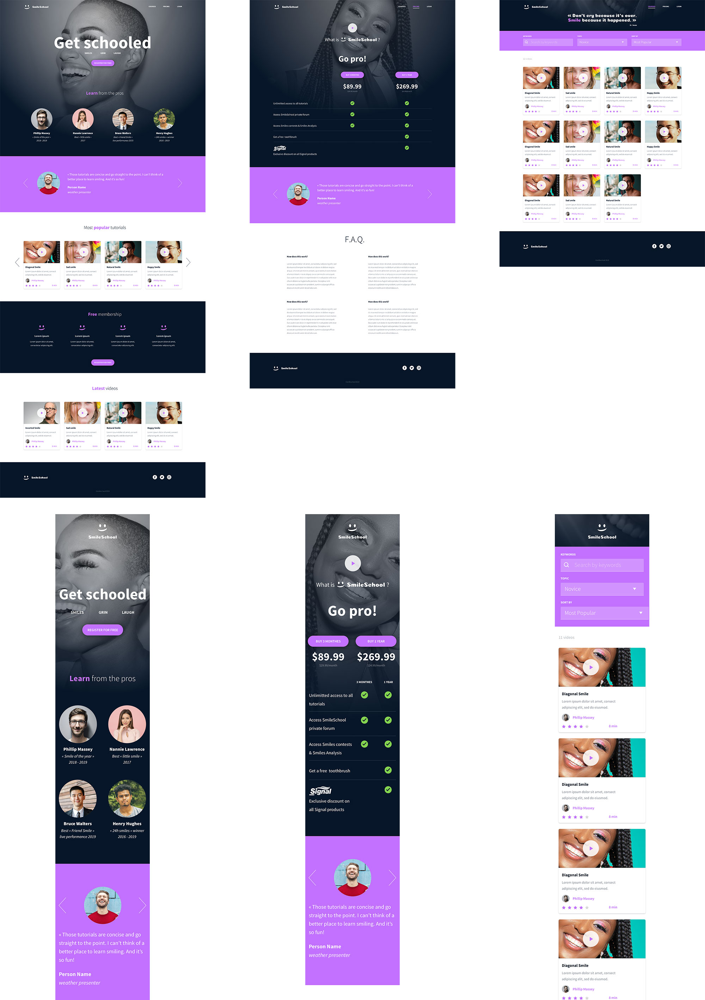

# 0x0B. Implement a design with bootstrap

In this project, you will implement 3 web pages with Bootstrap. You will use all HTML/CSS/Accessibility/Responsive design/Bootstrap knowledges that you learned previously.

You won’t have a lot of instruction, you are free to implement it the way that you want - the objective is simple: Have fully functional web pages that look the same as the designer file.

## Here the final result:   



## Requirements

- You have to use Bootstrap.
- Your styles.css must be as small as you can - you must use as much as you can Bootstrap classes.

## Imports

For this project, you will need: fonts from Google, JQuery, Bootstrap CSS/JS

```
<link href="https://fonts.googleapis.com/css?family=Source+Sans+Pro&display=swap" rel="stylesheet">
<link href="https://fonts.googleapis.com/css?family=Coiny&display=swap" rel="stylesheet">

<script src="https://code.jquery.com/jquery-3.4.1.min.js" integrity="sha256-CSXorXvZcTkaix6Yvo6HppcZGetbYMGWSFlBw8HfCJo=" crossorigin="anonymous"></script>
<script src="https://stackpath.bootstrapcdn.com/bootstrap/4.4.1/js/bootstrap.min.js" integrity="sha384-wfSDF2E50Y2D1uUdj0O3uMBJnjuUD4Ih7YwaYd1iqfktj0Uod8GCExl3Og8ifwB6" crossorigin="anonymous"></script>
<script src="https://cdnjs.cloudflare.com/ajax/libs/popper.js/1.12.9/umd/popper.min.js" integrity="sha384-ApNbgh9B+Y1QKtv3Rn7W3mgPxhU9K/ScQsAP7hUibX39j7fakFPskvXusvfa0b4Q" crossorigin="anonymous"></script>

<link rel="stylesheet" href="https://stackpath.bootstrapcdn.com/bootstrap/4.4.1/css/bootstrap.min.css" integrity="sha384-Vkoo8x4CGsO3+Hhxv8T/Q5PaXtkKtu6ug5TOeNV6gBiFeWPGFN9MuhOf23Q9Ifjh" crossorigin="anonymous">
```

## Resources

- [Documentation Bootstrap 4](https://getbootstrap.com/docs/4.6/getting-started/introduction/)
- [w3school - Bootstrap 4](https://www.w3schools.com/bootstrap4/)
- [mdbootstrap - Bootstrap 4 Tutorial](https://mdbootstrap.com/education/bootstrap/)
- [Complete guide centering CSS](https://css-tricks.com/centering-css-complete-guide/)

## Tasks

- Create the header/hero piece

- Create the section “Carousel of quotes”

- Create the section “Most popular tutorials”

- Create the section “Free membership”

- Create the section “Latest videos”

- Create the footer

- Now, let’s do the pricing page: create the header/hero piece.

- Create the prices grid

- Same as the Homepage, create the Carousel of quotes

- Create the FAQ grid

- Same as Homepage, create the footer.

- Now, let’s do the courses page: create the header/hero piece

- Create the search filters section

- Create the result section of courses

- Same as Homepage and Pricing page, create the footer

--- 
## Author 
* **Marlon A. Garcia M.** - [clasesucatmarlon](https://github.com/clasesucatmarlon)